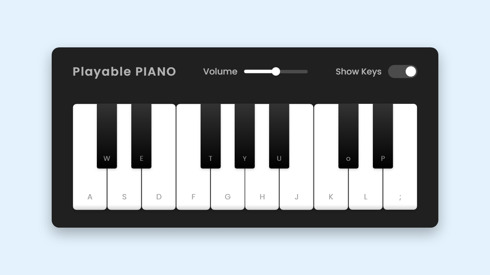

# Virtual Piano



A playable virtual piano built with HTML, CSS, and JavaScript that allows users to play musical notes using their keyboard or mouse clicks.

## Features

- Interactive piano keys that respond to both mouse clicks and keyboard presses
- Volume control slider to adjust the sound output
- Toggle option to show/hide key labels
- Responsive design that adapts to different screen sizes
- Realistic piano sounds for each key

## How to Use

1. Open `index.html` in your web browser
2. Use your computer keyboard to play the piano keys (a, w, s, e, d, f, t, g, y, h, u, j, k, o, l, p, ;)
3. Alternatively, click on the piano keys with your mouse
4. Adjust the volume using the slider in the top menu
5. Toggle the key labels visibility using the checkbox

## Keyboard Layout

White Keys: a, s, d, f, g, h, j, k, l, ;
Black Keys: w, e, t, y, u, o, p

## Project Structure

```
├── index.html
├── style.css
├── script.js
├── piano.jpg
└── tunes/
    └── (piano key sound files)
```

## Technologies Used

- HTML5
- CSS3
- JavaScript (ES6+)
- Web Audio API

## Responsive Design

The virtual piano is fully responsive and adapts to different screen sizes:
- Full keyboard on desktop screens
- Reduced keys on tablet screens (< 815px)
- Further reduced keys on mobile screens (< 615px)

Enjoy playing your virtual piano!